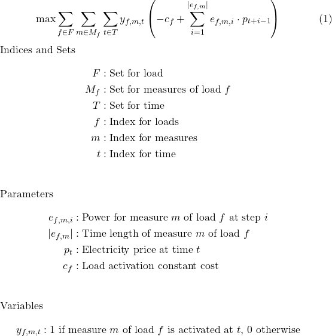

# Flextool LP Service

A Flask-based microservice that exposes a **linear programming optimization model** for flexible loads.  
It is a **simplified version of [FlexTool](https://flextool.synergie-projekt.de/start)**, designed as a showcase of coding, optimization, and documentation. The optimization model is proposed in "Energy flexibility scheduling optimization considering aggregated and non-aggregated industrial electrical loads" paper published in **[Energy Proceedings](https://www.energy-proceedings.org/energy-flexibility-scheduling-optimization-considering-aggregated-and-non-aggregated-industrial-electrical-loads/)**


This repository is a **showcase of coding, optimization, and documentation**:  
- 🚀 Run optimizations via REST API  
- 📦 Container-ready with Docker  
- 🧪 Includes example payload & test  
- 📖 Fully documented

---

## Quickstart

### Run locally (Python 3.10+)

```bash
git clone https://github.com/rbahmani01/Industrial_Flexibility_Tool.git
cd flextool-lp-service

python -m venv .venv
source .venv/bin/activate   # Windows: .venv\Scripts\activate

pip install -r requirements.txt
python app.py
```

Now the service runs at `http://localhost:5050`.

---

### Run with Docker

```bash
docker build -t flextool-lp-service:latest .
docker run --rm -p 5050:5050 flextool-lp-service:latest
```

---

## API

### Health check

```bash
curl http://localhost:5050/healthz
```

Response:

```json
{"status": "ok", "service": "flextool-lp-service", "version": "1.0.0"}
```

---

### Optimization endpoint

```bash
curl -X POST http://localhost:5050/optimize   -H "Content-Type: application/json"   --data @examples/sample_payload.json
```

Example response (truncated):

```json
{
  "result": {
    "Day_ahead_prices": [],
    "activated_measures":[]
    "totalEnergyConsumption": -24.0,
    "totalSavings": 2.24408
  }
  "status": 1,
}
```

---

## Example Payload

See [`examples/sample_payload.json`](examples/sample_payload.json) for a full working input.  


---

## Input Schema (high-level)

| Key | Type | Meaning |
|---|---|---|
| `flexibilities_set` | list[int] | Flexibility (Load) IDs |
| `measure_set` | list[int] | Measure IDs |
| `time_set` | list[int] | Time intervals (1-based) |
| `electricity_price` | list[float] | Day-ahead prices (€/MWh) |
| `start_cost[(f,m)]` | float | Start-up cost for measure `m` on flexibility `f` |
| `usageNumber_min/max` | list[int] | Min/max activations per flexibility |
| `time_length_of_measure[(f,m)]` | int | Duration for measures of flexibilities in intervals |
| `regeneration_time[(f,m)]` | int | Cooldown intervals after completion |
| `validity_in_time_format[f][t]` | 0/1 | Whether activation allowed |
| `power_for_measure[(f,m,i)]` | float | Power draw at step `i` of measure |
| `max_lenght_of_measure_among_all_efdms` | list[int] | indices fo max step among measures  |
| `measures_tuple[(f,m)]` | int | Flattened index for reporting |
| `dependencies` | lists of tuples | Optional temporal logic (implies/excludes) |

---

## How it Works

- **Decision vars**
  - `y[f,m,t] ∈ {0,1}` → measure `m` starts on `f` at time `t`  
  - `x[f,t] ∈ {0,1}` → any measure is active on `f` at time `t`  

- **Objective**
  - Maximize cost savings:  

    

- **Constraints**
  - Min/max usage per flexibility  
  - Duration + regeneration time enforced  
  - Validity windows respected  
  - Optional temporal dependencies  
  - Non-overlapping measures

## Solver
We used [PuLP](https://coin-or.github.io/pulp/) with CBC solver.

### Why PuLP?

We used **PuLP** because it offers a clean Python API, works with multiple solvers, integrates easily with our data pipeline, and is fast enough for the problem size.

### Limitations

PuLP also has some drawbacks:  
- Constraints often require nested loops, which makes the code look more verbose than in frameworks like Pyomo or Gurobi.  
- CBC, the default solver, is slower for very large problems compared to commercial solvers.  

Even with these trade-offs, PuLP was the most practical choice for balancing speed, clarity, and flexibility.

  ## 📚 Paper & Citation

This service is based on the model described in the paper **“Energy flexibility scheduling optimization considering aggregated and non-aggregated industrial electrical loads.”**

**Links:**
- [Energy Proceedings landing page](https://www.energy-proceedings.org/energy-flexibility-scheduling-optimization-considering-aggregated-and-non-aggregated-industrial-electrical-loads/)  

### 🔖 Citation (BibTeX)
```bibtex
@inproceedings{bahmani2022energy,
  title        = {Energy flexibility scheduling optimization considering aggregated and non-aggregated industrial electrical loads},
  author       = {Bahmani, Ramin and van Stiphoudt, Christine and Ansarin, Mohammad and Fridgen, Gilbert},
  booktitle    = {Energy Proceedings, 14th International Conference on Applied Energy (ICAE 2022)},
  volume       = {29},
  year         = {2022},
  doi          = {10.46855/energy-proceedings-10448},
  url          = {https://www.energy-proceedings.org/energy-flexibility-scheduling-optimization-considering-aggregated-and-non-aggregated-industrial-electrical-loads/}
}

